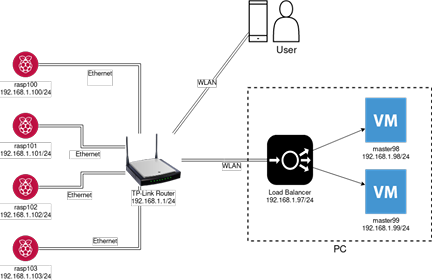

# Installation guide

More comprehensive instructions can be read from 
[Create Highly Available clusters with kubeadm](https://kubernetes.io/docs/setup/production-environment/tools/kubeadm/high-availability/) 



There are 3 main components in the system architectures:
1. Load balancer
2. Master nodes
3. Worker nodes

The nodes should be configured in this order.

### Set up Network Topology
connect all the physical nodes to the network. The network core can be just a router or a switch.
Assign the IP to all the nodes.

In this step, make sure that
- Nodes' IP will not be changing. Use static IP instead of DHCP.
- Every node is inside the same setwork (Kubernetes does not support multiply network cluster)
- Network address is different from the virtual address using in the cluster. 
(this virtual address can be configured in the network pod configuration)

### Configure Load balancer
Load balancer is a component that distributes the incoming traffic to increase availability of the system.

There are many software that can be used such as NGINX, HAProxy, etc. In this guide, we will show how to install
[HAProxy](http://www.haproxy.org/).

// TBD HAProxy install guide

### Configure master nodes
Before a node can be configured, the following software needs to be install
- kubeadm 
- kubelet
- kubectl

Please make sure that every node is using the same version of kubernetes,
otherwise some configurations might crash on some nodes.

In the first node, run this command
``` 
sudo kubeadm init --token-ttl=0 --control-plane-endpoint "LOAD_BALANCER_DNS:LOAD_BALANCER_PORT" --upload-certs
```

In other master nodes, simply join the control plane by using the token from the first init.
```
sudo kubeadm join <MASTER_NODE_IP>:6443 --token <TOKEN>
--discovery-token-ca-cert-hash sha256:<CA_CERF_SHA256_HASH> 
--control-plane --certificate-key <CERF_KEY>
```
The token can be seen from the last few lines of the first node init result 
or you can run `kubeadm token create --print-join-command` and add `--control-plane` at the end.

After that, install the network pod. There are many [options]() to use. 
One of the possibilities is Weave net which can be deployed by running
``` 
kubectl apply -f "https://cloud.weave.works/k8s/net?k8s-version=$(kubectl version | base64 | tr -d '\n')" 
```

### Configure worker nodes
As same as master nodes, firstly, install kubernetes (kubelet, kubeadm, kubectl) on the node
(also make sure it the same version).

In every worker node, run this command to join the cluster
```
sudo kubeadm join <MASTER_NODE_IP>:6443 --token <TOKEN>
--discovery-token-ca-cert-hash sha256:<CA_CERF_SHA256_HASH>
```

This join command can be trieved by running `kubeadm token create --print-join-command` on the master node

### Checking the system is working
There are many ways to check if there is something wrong with the system
- `kubectl get nodes` to see the status of all nodes in the cluster. 
All nodes should be in the `<Ready>` state.
- `kubectl get pods -n kube-system` to see which pods are not working correctly.
You can restart them by removing the pods which result in new pods being created.

### Create application deployments and services
After the all the components are configured, the application can now be deployed.
To creatl the deployments and servicesm, simply apply the configuration files to the kubernetes
``` 
kubectl apply -f deploy-scripts/deployments.yaml deploy-scripts/services.yaml 
```
